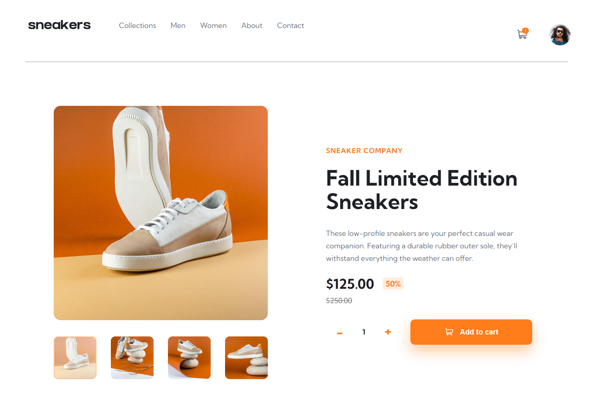

# Sneakers - E-commerce Product Page

This project is a visually engaging e-commerce product page featuring an interactive lightbox gallery for enhanced product viewing and a functional shopping cart system for real-time item management. It demonstrates proficient JavaScript skills and modern UI/UX practices, providing an immersive user experience ideal for e-commerce applications.

This is a solution to the [E-commerce product page challenge on Frontend Mentor](https://www.frontendmentor.io/challenges/ecommerce-product-page-UPsZ9MJp6).

## Overview

### Screenshot

### Links

- Live Site URL: [See the live page here](https://kasia307584.github.io/challenge_Ecommerce-Product-Main-Page/)

### The challenge

Users should be able to:

- Open a lightbox gallery by clicking on the large product image
- Switch the large product image by clicking on the small thumbnail images
- Add items to the cart
- View the cart and remove items from it
- See hover states for all interactive elements on the page

## My process

### Built with

- Vanilla JS using an OOP paradigm
- CSS custom properties for maintainable styling
- BEM methodology for organized CSS structure
- Semantic HTML5 markup for accessibility and SEO

### What I learned

- Write code using the Object-Oriented Programming (OOP) paradigm
- Create a lightbox feature with an interactive gallery

### Continued development

- add ARIA attributes to improve accessibility
- conduct validation to address any HTML/CSS errors or accessibility warnings
- implement full responsiveness for various screen sizes
- refine hover states on the menu for better interactivity
- update the item counter to accumulate added items rather than replacing the previous count

## Author

- Frontend Mentor - [See my solutions here](https://www.frontendmentor.io/profile/Kasia307584)
